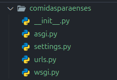
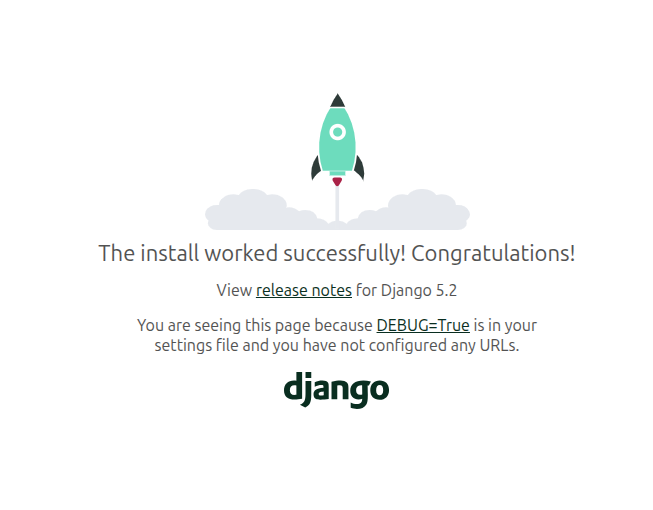
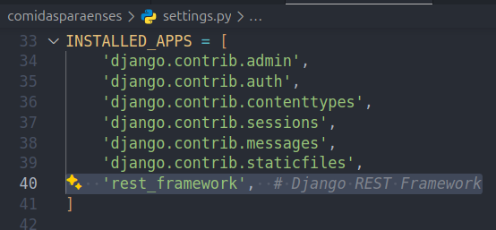
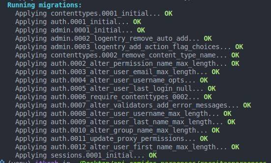
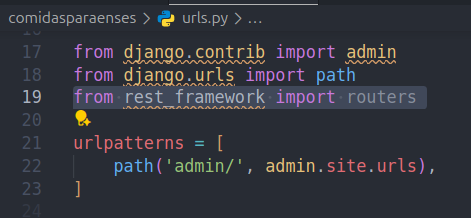
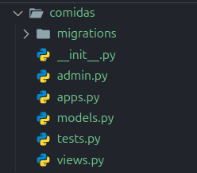
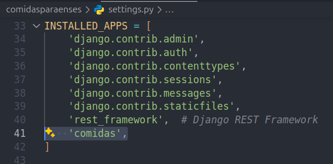

# Coding Dojo: API Rest com Python

## Objetivo

Este repositório tem como objetivo propor um desafio para dojos de python com Django

### O que será feito ?

Desenvolver uma API Rest de comidas paraenses.

- **round 1: preparação do ambiente e criação do projeto**
  - No primeiro round os participantes deverão criar o ambiente virtual ativá-lo e criar o projeto em Django.
- **round 2: Django Rest Framework**
  - No segundo round os participantes terão de instalar e configurar o DRF e validar a configuração.

- **round 3: Modelagem do banco de dados**
  - No terceiro round os participantes terão que modelar o banco de dados, gerar as migrações e aplicar as migrações no banco de dados.

- **round 4: Criação de uma ViewSets sem modelo e configuração das rotas da API**
  - No quarto round do dojo os participantes terão que construid uma ViewSets sem modelo e fazer a configuração das rotas com rest_framework.
- **round 5: ViewSets e Serializers com modelo e testes com Thunder Client**
  - No quarto round do dojo os participantes terão que construid uma ViewSets sem modelo e fazer a configuração das rotas com rest_framework.

- **round 6: TDD**
   - Neste round os participantes terão que codificar alguns casos de testes simples para exemplificar a prática de TDD

- **round 7: Django Admin**
   - No último round os participantes terão que configurar a interface visual do Django Admin para gerenciar as receitas, permitando assim um operação de CRUD na interface visual do Django Admin.

Nos minutos finais da timebox será feita uma pequena retrospectiva do que foi desenvolvido e o que foi codificado será enviado para o repo do GruPy PA e ficará disponível para quem quiser e puder contribuir para melhorar!

Você pode utilizar este guia para estudar e praticar por conta própria :)

#### ROUND 1: Preparação do ambiente e criação do projeto

Objetivo: Criação e ativação do ambiente virtual, instalação do Django, iniciar um novo projeto Django e iniciar o servidor de desenvolvimento.

Criação do ambiente virtual

```sh
python -m venv venv
```

Ativação do ambiente virtual

```sh
source venv/bin/activate
```

Após a criação e ativação do ambiente virtual os participantes terão que instalar o Django, iniciar um novo projeto e iniciar o servidor de testes a partir do manage.py

Instalação do Django

```sh
pip install django
```

Criação do projeto

```sh
django-admin startproject comidasparaenses .
```

O projeto deve ficar com a seguinte estrutura:

<center>



</center>


Iniciando o projeto:

```sh
python manage.py runserver
```

Agora é só acessar a URL http://localhost:8000/

<center>



</center>

#### ROUND 2: Django Rest Framework

Objetivo: Instalar o DRF e plugar a biblioteca no Django.

instalação do DRF

```sh
pip install djangorestframework
```

Para "plugar" o DRF no Django, acesse o arquivo `settings.py` de configurações do projeto:


Adicione o DRF na lista de apps instaladas


<center>



</center>


Agora, atualize o banco de dados com o comando migrate

```sh
python manage.py migrate
```


<center>



</center>


Agora vamos adicionar uma linha de código no arquivo `comidasparaenses/urls.py`

Adicione a linha a seguir logo abaixo da importação do path:

```py
from rest_framework import routers
```

O arquivo deve ficar assim:


<center>



</center>


Agora é só executar o servidor de testes novamente!

```sh
python manage.py runserver
```

Acessando a URL  http://localhost:8000 novamente deve aparecer a tela do Django, indicando que Django está pronto para uso e o DRF foi plugado corretamente!


<center>


</center>


#### ROUND 3: Modelagem do banco de dados

Objetivo: Modelar o banco de dados, gerar e aplicar as migrações


Criar a app de receitas

```sh
python manage.py startapp comidas
```

A estrutura da app deve ficar nesse formato:

<center>



</center>

No Django as apps são como se fossem módulos do projeto, assim como o DRF é um módulo para trabalhar com APIs RestFull de forma mais simplificada, a app `comidas` irá lidar com as comidas que iremos criar e disponibilizar via requisição HTTP.

Toda app no Django corresponde a uma tabela no banco de dados, mas não se preocupe, não será necessário escrever nenhuma linha de SQL para criar a tabela e configurar os campos! O motor de ORM (Object-relational Mapping - Mapeamento Objeto-relacional) irá cuidar de tudo isso.

E sempre que uma nova app for criada ela precisa ser plugada no Django, assim como foi feito com o rest_framework

<center>



</center>


Agora vamos codificar o banco de dados, acesse o arquivo `comidas/models.py`, você verá que na primeira linha importou os `models`, ou modelos.

Os modelos são a camada de definição de dados que representam a estrutura das tabelas do seu banco de dados, como tipos de campos e nomes de tabelas e etc...

Todo modelo em Django precisa ser uma classe filha da classe Model para que o Django entanda que aquela classe se trata de uma tabela no banco de dados.

Vamos codificar o modelo `Comida`, para isso adicione o código abaixo no arquivo `comidas/models.py`

```py

class Comida(models.Model):
    nome = models.CharField(max_length=100)
    descricao = models.TextField()
    foto_url = models.URLField(max_length=300, blank=True, null=True)

```

Nesse caso estamos criando a classe `Comida`, ou seja, uma tabela no banco de dados. Essa classe possuí três colunas:

Campo | Tipo | Descrição
------|------|-----------
nome | String, tamanho máximo 100 caracteres| Nome da comida
descricao| Texto livre | Descrição da comida
foto_url | URL com no máximo 300 caracteres, pode ser nulo e pode ser vazio | URL da comida

Após a codificação das propriedades é necessário executar duas ações: gerar as migrações do banco de dados e aplicar as migrações no banco de dados.

Para gerar as migrações, execute

```bash
python manage.py makemigrations
```

A saída deve ser algo indicando que a ação a ser executada é a criação de um novo Model:

```sh
Migrations for 'comidas':
  comidas/migrations/0001_initial.py
    + Create model Comida
```

E para aplicar as migrações, execute

```bash
python manage.py migrate
```

A saída deve indicar que a migração foi aplicada no banco de dados

```sh
Running migrations:
  Applying comidas.0001_initial... OK
```

Ótimo! o banco de dados foi criado!

Podemos utilizar o aplicativo https://inloop.github.io/sqlite-viewer/ para visualizar a tabela.

#### ROUND 4: Criação de uma ViewSets comum e configuração das rotas da API

Objetivo: Criar uma ViewSets simples e configurar as URLs da API.

As ViewSets são as classes que lidam com as requisições HTTP e fazem a tratativa dos verbos GET, POST, PUT, DELETE, entre outros. As ViewSets também estabelecem permissões para cada tipo de recurso acessado.

Acesse arquivo `comidas/views.py` e vamos codificar a primeira ViewSets.

Adicione o conteúdo ao arquivo:

```py
from rest_framework.viewsets import ViewSet
from rest_framework.response import Response
from rest_framework import status

class ViewSetStatus(ViewSet):

    def list(self, request):
        return Response({ "message": "API funcionando!" }, status=status.HTTP_200_OK)
```

Agora que a view de status foi codificada é necessário configurar as rotas da API, para isso edite o arquivo `urls.py` da seguinte forma:

```py
from django.contrib import admin
from django.urls import path, include
from rest_framework import routers

from comidas.views import ViewSetStatus

router = routers.DefaultRouter()

router.register(r'status', ViewSetStatus, basename='status')

urlpatterns = [
    path('admin/', admin.site.urls),
    path('api/v1/comidas-paraenses/', include(router.urls)),
]
```

Acessando a URL `http://localhost:8000/api/v1/comidas-paraenses/status/` a API deve retornar

```JSON
{
    "message": "API funcionando!"
}
```

#### ROUND 5: Criação das ViewSets e Serializers com modelo e testando o CRUD automático do DRF com o Thunder Client

Objetivo: Criar um Serializer e uma ViewSets e

Serializers é um mecanismo capaz de transformar dados complexos, como objetos Django, em objetos mais simples como o JSON.

O DRF fornece mecanismos que simplificam muito a criação de Serializers de modelos, facilitando a criação de um CRUD.

Crie o arquivo `comidas/serializers.py` e adicione o conteúdo:

```py
from rest_framework.serializers import ModelSerializer

from comidas.models import Comida

class ComidaParaenseSerializer(ModelSerializer):
    class Meta:
        model = Comida
        fields = '__all__'
```

Atualizando o arquivo `comidas/views.py`

```py
from rest_framework.viewsets import ViewSet, ModelViewSet
from rest_framework.response import Response
from rest_framework import status

from comidas.serializers import ComidaParaenseSerializer
from comidas.models import Comida

class ViewSetStatus(ViewSet):

    def list(self, request):
        return Response({ "message": "API funcionando!" }, status=status.HTTP_200_OK)

class ComidasViewSet(ModelViewSet):
    serializer_class = ComidaParaenseSerializer
    queryset = Comida.objects.all()
```

Depois que a ViewSets e o Serialier estiverem prontos, agora é só atualizar o arquivo `urls.py`

```py
from django.contrib import admin
from django.urls import path, include
from rest_framework import routers

from comidas.views import ViewSetStatus, ComidasViewSet

router = routers.DefaultRouter()

router.register(r'status', ViewSetStatus, basename='status')
router.register(r'comidas', ComidasViewSet, basename='comidas')

urlpatterns = [
    path('admin/', admin.site.urls),
    path('api/v1/comidas-paraenses/', include(router.urls)),
]
```

Perfeito, agora é só testar o CRUD com o Thunder Client!

#### ROUND 6: TDD

Test Driven Developer: Desenvolvimento guiado por testes.

Objetivo: criar testes para validar o comportamento padrão da API

Abra o arquivo `comidas/tests.py` e adicione o seguinte código:

```py
from django.test import TestCase

from rest_framework.test import APIClient

client = APIClient()

class StatusViewSetTestCase(TestCase):
    def setUp(self):
        self.client = APIClient()

    def test_status_endpoint(self):
        response = self.client.get('/api/v1/comidas-paraenses/status/')
        self.assertEqual(response.status_code, 200)
        self.assertEqual(response.data, {"message": "API funcionando!"})
```

Nesse exemplo o grupo de testes denominado `StatusViewSetTestCase` tem apenas um teste chamado `test_status_endpoint` que irá validar o endpoint /status.

Para rodar os testes, execute o comando

```sh
python manage.py test
```

A saída no console será algo do tipo:

```sh
Found 1 test(s).
Creating test database for alias 'default'...
System check identified no issues (0 silenced).
....
----------------------------------------------------------------------
Ran 1 tests in 0.013s

OK
Destroying test database for alias 'default'...
```

Agora vamos criar os testes para a rota /comidas, adicione a classe no arquivo `comidas/tests.py`:

```py
class ComidasViewSetTestCase(TestCase):
    def setUp(self):
        self.client = APIClient()

    def test_comidas_list(self):
        response = self.client.get('/api/v1/comidas-paraenses/comidas/')
        self.assertEqual(response.status_code, 200)
        self.assertEqual(response.data, [])

    def test_comidas_create(self):
        data = {
            "nome": "Tacacá",
            "descricao": "Uma sopa típica da região Norte do Brasil.",
        }
        response = self.client.post('/api/v1/comidas-paraenses/comidas/', data, format='json')
        self.assertEqual(response.status_code, 201)
        self.assertEqual(response.data['nome'], data['nome'])

    def test_comidas_retrieve(self):
        data = {
            "nome": "Açaí",
            "descricao": "Fruta típica da Amazônia.",
        }

        create_response = self.client.post('/api/v1/comidas-paraenses/comidas/', data, format='json')
        comida_id = create_response.data['id']

        response = self.client.get(f'/api/v1/comidas-paraenses/comidas/{comida_id}/')
        self.assertEqual(response.status_code, 200)
        self.assertEqual(response.data['nome'], data['nome'])
```

Para rodar os testes, execute novamento o comando

```sh
python manage.py test
```

A saída no console será algo do tipo:

```sh
Found 4 test(s).
Creating test database for alias 'default'...
System check identified no issues (0 silenced).
....
----------------------------------------------------------------------
Ran 4 tests in 0.013s

OK
Destroying test database for alias 'default'...
```

Os testes são fundamentais para garantir a qualidade do sistema ao logo do seu ciclo de desenvolvimento e de vida, o desenvolvimento guiado por testes é uma das práticas mais importantes no desenvolvimento de softwares, se não a mais.

Manter os testes sempre atualizados é fundamental para manter a qualidade do sistemas e dar segurança aos programadores para evoluir o sistema.

#### ROUND 7: Django Admin

Objetivo: Configurar a app Comida no painel admin do Django

Primeiro é necessário criar um super usuário no Django

```sh
python manage.py createsuperuser --username admin --email admin@admin.com
```

Depois o servidor de desenvolvimento precisa estar em execução:

```sh
python manage.py runserver
```

Agora é só acessar a URL http://localhost:8000/admin/ e logar com o usuário criado.

Adicionar a app comida ao Admin no Django

```py
from django.contrib import admin
from .models import Comida

admin.site.register(Comida)
```

### Eai, o que você achou?


<center>


</center>